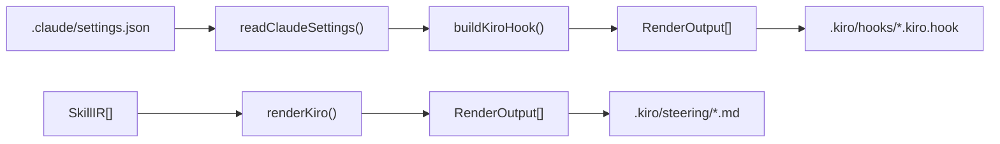
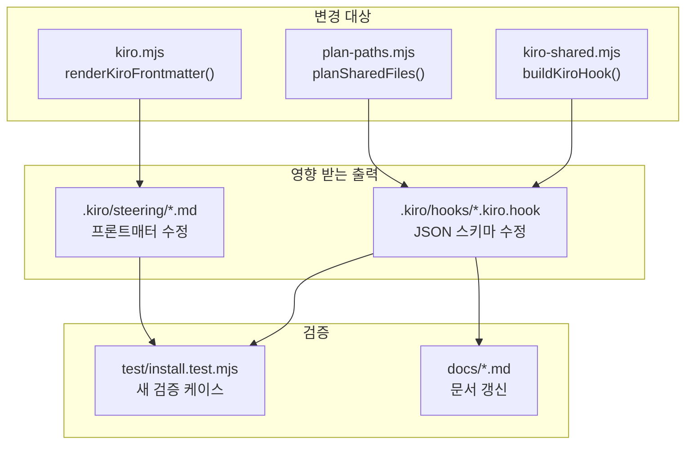

# 설계 문서: kiro-xm-compatibility

## 개요

`xm install --target kiro`가 생성하는 Kiro 훅 JSON과 steering 파일이 Kiro의 실제 스키마와 불일치하는 문제를 수정하고, trace-session 훅의 best-effort 지원을 추가하며, 테스트와 문서를 갱신하는 설계입니다.

### 핵심 변경 요약

1. **Hook_Renderer (`kiro-shared.mjs`)**: `when.tool` → `when.toolTypes[]`, `version: "1"` → `"1.0.0"`, `enabled` 필드 제거, 이벤트명 수정, Skill 매처 best-effort 변환
2. **Steering_Renderer (`kiro.mjs`)**: 프론트매터에서 `name` 필드 제거, description 품질 경고 강화
3. **Path_Planner (`plan-paths.mjs`)**: 다중 훅 파일 경로 계획 지원
4. **테스트/문서**: 스키마 정합성 검증 테스트 추가, 영문/한국어 문서 갱신

### 설계 원칙

- **최소 변경**: 기존 렌더러 아키텍처(SkillIR → Renderer → RenderOutput)를 유지하면서 출력 JSON 구조만 수정
- **하위 호환**: 기존 설치된 훅 파일은 재설치 시 자동으로 올바른 스키마로 덮어쓰기
- **Best-effort 원칙**: Skill 매처처럼 Kiro에 직접 대응이 없는 기능은 가장 가까운 대안으로 변환하되, 한계를 명시

---

## 아키텍처

### 현재 데이터 흐름



### 변경 영향 범위



### 변경하지 않는 것

- `SkillIR` 타입 정의 (`types.mjs`) — frozen interface
- `readClaudeSettings()` (`cursor-shared.mjs`) — 입력 파싱 로직 불변
- `security.mjs` — `assertSafeCommand()` 불변
- `merge.mjs` — 파일 쓰기/잠금 메커니즘 불변
- manifest 생성/검증 로직 불변

---

## 컴포넌트 및 인터페이스

### 1. `buildKiroHook()` 수정 (kiro-shared.mjs)

현재 시그니처는 유지하되 반환하는 JSON 구조를 변경합니다.

```typescript
// 변경 전 (현재 — 잘못된 스키마)
{
  enabled: true,                    // ❌ Kiro 스키마에 없음
  name: string,
  description: string,
  version: '1',                     // ❌ semver 아님
  when: { type: string, tool: string },  // ❌ tool은 문자열
  then: { type: 'runCommand', command: string }
}

// 변경 후 (올바른 Kiro 스키마)
{
  name: string,
  description: string,
  version: '1.0.0',                 // ✅ semver
  when: {
    type: string,
    toolTypes?: string[],           // ✅ 도구 이벤트용 배열
    patterns?: string[]             // ✅ 파일 이벤트용 배열
  },
  then: { type: 'runCommand', command: string }
}
```

**`translateEvent()` 수정**:

```typescript
// 추가할 매핑
case 'FileCreate':  return 'fileCreated';   // 과거시제
case 'FileSave':    return 'fileEdited';    // 과거시제 + 동사 변경
case 'FileDelete':  return 'fileDeleted';   // 과거시제
```

**`translateMatcher()` 수정 — Skill 매처 best-effort**:

현재 `Skill` 매처는 `null`을 반환하여 훅이 완전히 스킵됩니다. 변경 후에는 `['*']`로 폴백하되 best-effort 안내를 포함합니다.

```typescript
// Skill 매처 처리 로직
if (token === 'Skill') {
  return { toolTypes: ['*'], bestEffort: true };
}
```

**`when` 필드 분기 로직**:

```typescript
const isFileEvent = ['fileEdited', 'fileCreated', 'fileDeleted'].includes(event);
if (isFileEvent) {
  when = { type: event, patterns: patternsArray };  // toolTypes 없음
} else {
  when = { type: event, toolTypes: toolTypesArray }; // patterns 없음
}
```

### 2. `renderKiroFrontmatter()` 수정 (kiro.mjs)

`name` 필드를 프론트매터에서 제거합니다.

```typescript
// 변경 전
export function renderKiroFrontmatter(fm) {
  const lines = ['---'];
  lines.push(`inclusion: ${fm.inclusion}`);
  if (fm.fileMatchPattern !== undefined) { ... }
  if (fm.name !== undefined) lines.push(`name: ${fm.name}`);      // ❌ 제거
  if (fm.description !== undefined) lines.push(`description: ...`);
  lines.push('---');
  return lines.join('\n') + '\n\n';
}

// 변경 후
export function renderKiroFrontmatter(fm) {
  const lines = ['---'];
  lines.push(`inclusion: ${fm.inclusion}`);
  if (fm.fileMatchPattern !== undefined) { ... }
  // name 필드 제거 — Kiro 표준 프론트매터에 없음
  if (fm.description !== undefined) lines.push(`description: ...`);
  lines.push('---');
  return lines.join('\n') + '\n\n';
}
```

호출부(`renderKiroWithDiagnostics`)에서도 `name` 파라미터 전달을 제거합니다.

### 3. `planSharedFiles()` 수정 (plan-paths.mjs)

현재 단일 `xm.kiro.hook` 경로만 계획합니다. 다중 훅 파일을 지원하도록 변경합니다.

```typescript
// 변경 전
if (target === 'kiro') {
  out.push({
    absolutePath: join(root, '.kiro', 'hooks', 'xm.kiro.hook'),
    kind: 'hook',
    skill: '*',
    writeMode: 'overwrite',
    mode: modeFor(scope),
  });
}

// 변경 후: 실제 훅 파일 목록은 renderKiroShared()가 결정하므로,
// plan에서는 hooks 디렉토리를 대표 경로로 유지하되
// manifest는 실제 생성된 파일 목록을 기록
```

**설계 결정**: `planSharedFiles()`는 사전에 훅 개수를 알 수 없으므로 (Claude settings.json 파싱이 필요), 기존 대표 경로 방식을 유지합니다. 실제 파일 목록은 `renderKiroShared()`의 `outputs[]`에서 결정되며, manifest는 이 outputs를 기반으로 생성됩니다. 이는 Codex의 `hooks.json` (단일 파일)과 달리 Kiro는 훅당 1파일이므로 동적 결정이 필요하기 때문입니다.

### 4. Kiro 이벤트 타입 매핑 테이블

| Claude 이벤트 | Kiro 이벤트 | 비고 |
|:---|:---|:---|
| `PreToolUse` | `preToolUse` | `when.toolTypes` 사용 |
| `PostToolUse` | `postToolUse` | `when.toolTypes` 사용 |
| `Stop` | `agentStop` | `when.toolTypes` 불필요 |
| `UserPromptSubmit` | `promptSubmit` | `when.toolTypes` 불필요 |
| `FileCreate` | `fileCreated` | `when.patterns` 사용 |
| `FileSave` | `fileEdited` | `when.patterns` 사용 |
| `FileDelete` | `fileDeleted` | `when.patterns` 사용 |
| `SessionStart` | _(없음)_ | 스킵 + notes 기록 |

### 5. Skill 매처 Best-Effort 변환 전략

Claude의 `Skill` 매처는 Kiro에 직접 대응이 없습니다. Best-effort 전략:

1. `trace-session.mjs pre` → `preToolUse` + `toolTypes: ["*"]` + best-effort 안내
2. `trace-session.mjs post` → `postToolUse` + `toolTypes: ["*"]` + best-effort 안내
3. description에 "best-effort adaptation — Kiro has no Skill matcher equivalent" 포함
4. 의미 있는 매핑이 불가능한 경우 (예: Skill 전용 로직이 command에 하드코딩) → 스킵 + notes 기록

**근거**: `trace-session.mjs`는 세션 추적 목적이므로 모든 도구 호출에 대해 실행해도 기능적으로 유사합니다. `toolTypes: ["*"]`는 Kiro에서 모든 도구 호출에 트리거되므로 가장 가까운 근사치입니다.

---

## 데이터 모델

### Kiro Hook JSON 스키마 (올바른 형태)

```json
{
  "name": "xm-pretooluse-0",
  "description": "Note: Kiro hooks cannot block tool execution...",
  "version": "1.0.0",
  "when": {
    "type": "preToolUse",
    "toolTypes": ["write"]
  },
  "then": {
    "type": "runCommand",
    "command": "node \".kiro/xm/hooks/block-marketplace-copy.mjs\""
  }
}
```

### Kiro Hook JSON — 파일 이벤트 예시

```json
{
  "name": "xm-fileedited-0",
  "description": "Runs on file edit events",
  "version": "1.0.0",
  "when": {
    "type": "fileEdited",
    "patterns": ["*.ts", "*.tsx"]
  },
  "then": {
    "type": "runCommand",
    "command": "node \".kiro/xm/hooks/lint-check.mjs\""
  }
}
```

### Kiro Hook JSON — Skill 매처 Best-Effort 예시

```json
{
  "name": "xm-pretooluse-1",
  "description": "best-effort adaptation — Kiro has no Skill matcher equivalent. Original Claude hook targeted Skill matcher for trace-session. Note: Kiro hooks cannot block tool execution (R-SEC-09).",
  "version": "1.0.0",
  "when": {
    "type": "preToolUse",
    "toolTypes": ["*"]
  },
  "then": {
    "type": "runCommand",
    "command": "node \".kiro/xm/hooks/trace-session.mjs\" pre"
  }
}
```

### Kiro Steering 프론트매터 (수정 후)

```yaml
---
inclusion: auto
description: "xm-build — Phase-based project harness for managing project lifecycle, DAG execution, cost forecasting, and agent orchestration"
---
```

**변경점**: `name` 필드 제거. Kiro는 파일명으로 steering 파일을 식별하므로 프론트매터에 `name`이 불필요합니다.

### 변경 전후 비교

| 필드 | 변경 전 (잘못됨) | 변경 후 (올바름) |
|:---|:---|:---|
| `enabled` | `true` | _(제거)_ |
| `version` | `"1"` | `"1.0.0"` |
| `when.tool` | `"write"` | _(제거)_ |
| `when.toolTypes` | _(없음)_ | `["write"]` |
| `when.patterns` | _(없음)_ | 파일 이벤트 시 `["*.ts"]` |
| steering `name` | `xm-build` | _(제거)_ |


---

## 정확성 속성 (Correctness Properties)

*정확성 속성(property)은 시스템의 모든 유효한 실행에서 참이어야 하는 특성 또는 동작입니다. 사람이 읽을 수 있는 명세와 기계가 검증할 수 있는 정확성 보장 사이의 다리 역할을 합니다.*

Prework 분석에서 도출된 속성들을 중복 제거 및 통합한 결과입니다.

### Property 1: 훅 JSON 스키마 정합성

*For any* 유효한 Claude 훅 입력(이벤트 + 매처 + 커맨드)에 대해, `buildKiroHook()`이 non-null JSON을 반환할 때, 해당 JSON은 다음을 모두 만족해야 한다:
- `version`이 semver 형식 (`/^\d+\.\d+\.\d+$/`)
- `enabled` 필드가 존재하지 않음
- `when.tool` 필드(문자열)가 존재하지 않음
- 도구 이벤트(`preToolUse`, `postToolUse`)일 때 `when.toolTypes`가 문자열 배열이고 `when.patterns`가 없음
- 파일 이벤트(`fileEdited`, `fileCreated`, `fileDeleted`)일 때 `when.patterns`가 문자열 배열이고 `when.toolTypes`가 없음
- 기타 이벤트(`agentStop`, `promptSubmit`)일 때 `when.toolTypes`와 `when.patterns` 모두 없음

**Validates: Requirements 1.1, 1.2, 1.3, 1.4, 1.5, 3.1, 3.2, 3.3**

### Property 2: 미지원 이벤트 스킵

*For any* Claude 이벤트 문자열이 지원 매핑 테이블(`PreToolUse`, `PostToolUse`, `Stop`, `UserPromptSubmit`, `FileCreate`, `FileSave`, `FileDelete`)에 없을 때, `buildKiroHook()`은 `json: null`을 반환하고 `note`가 비어있지 않은 문자열이어야 한다.

**Validates: Requirements 2.6**

### Property 3: Steering 프론트매터 정합성

*For any* SkillIR 입력에 대해, `renderKiroFrontmatter()`가 생성하는 프론트매터는 다음을 모두 만족해야 한다:
- `name:` 라인이 존재하지 않음
- `inclusion:` 라인이 존재함
- `inclusion`이 `auto`일 때 `description:` 라인이 존재함

**Validates: Requirements 4.1, 4.2, 4.3**

### Property 4: 짧은 Description 경고

*For any* SkillIR의 description이 30자 미만일 때, `renderKiroWithDiagnostics()`의 `warnings` 배열에 해당 스킬명과 글자 수를 포함하는 경고 메시지가 존재해야 한다.

**Validates: Requirements 5.1, 5.2**

### Property 5: Skill 매처 Best-Effort 변환

*For any* Claude 훅이 `Skill` 매처를 사용하고 유효한 command를 가질 때, `buildKiroHook()`은 non-null JSON을 반환하며, 해당 JSON의 `when.toolTypes`는 `["*"]`이고 `description`에 "best-effort" 문자열이 포함되어야 한다.

**Validates: Requirements 6.1, 6.2**

### Property 6: 훅 파일 고유성

*For any* Claude settings.json의 훅 목록에 대해, `renderKiroShared()`가 반환하는 `outputs[]`의 각 `relativePath`는 모두 고유해야 하며, outputs의 길이는 변환 가능한 훅의 수와 같아야 한다.

**Validates: Requirements 7.1, 7.3**

---

## 에러 처리

### 1. 매핑 불가 이벤트

- **상황**: Claude 이벤트(`SessionStart` 등)에 대응하는 Kiro 이벤트가 없음
- **처리**: `buildKiroHook()`이 `{ json: null, note: "kiro: skipping ..." }` 반환
- **사용자 피드백**: install stdout의 notes 섹션에 스킵 사유 출력

### 2. 매핑 불가 매처

- **상황**: Claude 매처 토큰이 `KIRO_TOOL_MAP`에 없고 `Skill`도 아닌 경우
- **처리**: 해당 토큰 무시, 매핑 가능한 토큰만 사용. 모든 토큰이 매핑 불가면 `null` 반환
- **변경점**: `Skill` 토큰은 이제 `null` 대신 `['*']`로 폴백 (best-effort)

### 3. 빈 command

- **상황**: 훅의 command가 빈 문자열이거나 undefined
- **처리**: 기존 로직 유지 — `typeof h.command !== 'string'` 체크로 스킵
- **변경 없음**

### 4. 보안 검증 실패

- **상황**: `assertSafeCommand()`가 위험한 command를 감지
- **처리**: 기존 로직 유지 — 예외 throw, 해당 훅 스킵
- **변경 없음**

### 5. Description 품질 경고

- **상황**: steering 파일의 description이 30자 미만
- **처리**: 경고 출력 (설치는 계속 진행)
- **심각도**: WARNING (설치 실패 아님)

---

## 테스트 전략

### PBT 적용 판단

이 기능은 **순수 함수 기반 데이터 변환** (Claude hook JSON → Kiro hook JSON, SkillIR → steering frontmatter)이므로 property-based testing에 적합합니다.

- 입력 공간이 넓음: 다양한 이벤트 타입, 매처 조합, command 문자열
- 출력에 대한 보편적 불변식이 존재: 스키마 정합성, 필드 존재/부재, 타입 제약
- 순수 함수: `buildKiroHook()`, `translateEvent()`, `translateMatcher()`, `renderKiroFrontmatter()`는 모두 부작용 없음
- 100회 이상 반복이 비용 효율적: 인메모리 연산만 수행

### 테스트 프레임워크

- **단위/통합 테스트**: `bun:test` (기존 `test/install.test.mjs`와 동일)
- **Property-based 테스트**: `fast-check` (bun 호환, JavaScript 생태계 표준 PBT 라이브러리)
- **최소 반복 횟수**: property당 100회

### Property-Based 테스트 계획

| Property | 테스트 파일 | 생성기 | 검증 내용 |
|:---|:---|:---|:---|
| P1: 훅 스키마 정합성 | `test/kiro-hook-schema.prop.test.mjs` | 랜덤 이벤트 × 매처 × command | JSON 구조 불변식 전체 |
| P2: 미지원 이벤트 스킵 | 동일 파일 | 지원 목록 외 랜덤 문자열 | null 반환 + note 존재 |
| P3: 프론트매터 정합성 | `test/kiro-steering.prop.test.mjs` | 랜덤 SkillIR | name 부재, inclusion 존재 |
| P4: 짧은 description 경고 | 동일 파일 | 30자 미만 랜덤 문자열 | warnings 배열에 경고 존재 |
| P5: Skill 매처 best-effort | `test/kiro-hook-schema.prop.test.mjs` | Skill 매처 + 랜덤 command | toolTypes: ["*"] + best-effort 텍스트 |
| P6: 훅 파일 고유성 | 동일 파일 | 랜덤 개수의 훅 목록 | relativePath 중복 없음 |

### 태그 형식

```javascript
// Feature: kiro-xm-compatibility, Property 1: 훅 JSON 스키마 정합성
```

### 단위 테스트 계획 (example-based)

기존 `test/install.test.mjs`에 추가:

1. **이벤트 매핑 테이블 검증** (Req 2.1–2.5): 각 Claude 이벤트 → Kiro 이벤트 고정 매핑 확인
2. **Kiro 훅 스키마 검증** (Req 8.1–8.4): 실제 install 후 생성된 `.kiro.hook` 파일의 JSON 파싱 + 필드 검증
3. **Steering 프론트매터 검증** (Req 8.5): 실제 install 후 생성된 `.kiro/steering/*.md`의 프론트매터에 `name:` 없음 확인
4. **Trace-session best-effort** (Req 6.1–6.3): Skill 매처 훅이 스킵되지 않고 best-effort 출력 생성 확인
5. **문서 일관성** (Req 9.3–9.4): capability matrix에서 trace 훅 상태가 `△`인지 확인 (grep 기반)

### 통합 테스트 계획

기존 `test/install.test.mjs`의 Kiro 설치 테스트 확장:

```javascript
test('kiro hooks conform to Kiro schema', () => {
  // install → .kiro/hooks/*.kiro.hook 파일 읽기 → JSON 파싱 → 스키마 검증
});

test('kiro steering frontmatter has no name field', () => {
  // install → .kiro/steering/*.md 파일 읽기 → frontmatter 파싱 → name 부재 확인
});

test('kiro trace-session hook exists as best-effort', () => {
  // install → .kiro/hooks/ 에 trace-session 관련 훅 파일 존재 확인
});
```
