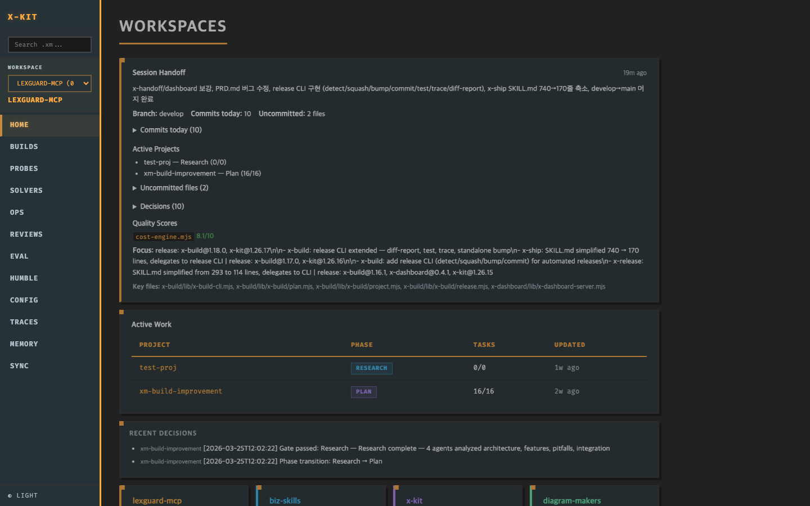

<p align="center">
  🇰🇷 한국어 | 🇺🇸 <a href="./README.md">English</a>
</p>

<p align="center">
  
</p>

<h1 align="center">x-kit</h1>

<p align="center">
  AI 코딩 에이전트는 조용히 실패합니다 — 계획 없이 코드를 쓰고, 맥락을 무시하며, 검증하지 않습니다.<br />
  <strong>x-kit이 이 문제를 해결합니다.</strong>
</p>

<p align="center">
  <a href="https://github.com/x-mesh/x-kit/releases"></a>
  <a href="./LICENSE"></a>
  <a href="https://nodejs.org"></a>
  <a href="#플러그인"></a>
</p>

<p align="center">
  <a href="https://docs.anthropic.com/en/docs/claude-code">Claude Code</a>에 체계적인 계획, 멀티 에이전트 리뷰, 품질 검증을 더하는 플러그인 툴킷입니다.<br />
  프로토타입이 아닌, 프로덕션 수준의 코드를 만들어 냅니다.
</p>

<p align="center">
  <code>/x-build plan "JWT 인증이 포함된 REST API 만들기"</code><br />
  → PRD → 태스크 분해 → 병렬 에이전트 실행 → 검증 완료 ✅
</p>

---

## 목차

- [설치](#설치)
- [빠른 시작](#빠른-시작)
- [왜 x-kit인가?](#왜-x-kit인가)
- [플러그인](#플러그인) — [x-build](#x-build) · [x-op](#x-op) · [x-review](#x-review) · [x-solver](#x-solver) · [x-probe](#x-probe) · [x-eval](#x-eval) · [x-humble](#x-humble) · [x-agent](#x-agent) · [x-trace](#x-trace) · [x-memory](#x-memory) · [x-dashboard](#x-dashboard) · [x-ship](#x-ship)
- [품질 & 학습 파이프라인](#품질--학습-파이프라인)
- [아키텍처](#아키텍처)
- [설정](#설정)
- [문제 해결](#문제-해결)
- [기여하기](#기여하기)
- [라이선스](#라이선스)

---

## 설치

### 사전 준비

x-kit은 테스트, 대시보드 서버, 스크립트 실행에 [Bun](https://bun.sh)을 JavaScript 런타임으로 사용합니다.

**왜 Bun인가?**
- 빠른 시작 — JIT 워밍업 없이 스크립트와 테스트가 즉시 실행됩니다
- 내장 테스트 러너 — `bun test`가 바로 동작하며 추가 devDependencies가 필요 없습니다
- 네이티브 TypeScript/ESM — `.ts`와 `.mjs` 파일을 트랜스파일 없이 직접 실행합니다
- 제로 설정 HTTP 서버 — npm 의존성 없이 `x-dashboard`를 구동합니다

```bash
# macOS / Linux
curl -fsSL https://bun.sh/install | bash

# Homebrew
brew install oven-sh/bun/bun

# Windows
powershell -c "irm bun.sh/install.ps1 | iex"
```

설치 후 `bun --version`으로 확인하세요 (v1.0 이상 필요).

> Node.js >= 18은 Claude Code 자체에 여전히 필요합니다. Bun은 x-kit 자체 도구에 사용됩니다.

### 플러그인 설정

```bash
/plugin marketplace add x-mesh/x-kit
/plugin install x-kit@x-kit -s user
```

### 최초 초기화

설치 후 프로젝트마다 한 번 실행하여 훅을 연결하고, `.claude/settings.json`을 병합하고, `x-sync` 클라이언트를 설치합니다:

```
/x-kit init              # 훅 + settings + x-sync 클라이언트 설치
/x-kit init --dry-run    # 변경 내용 미리보기 (쓰기 없음)
/x-kit init --skip-sync  # 훅 + settings만
/x-kit init --rollback   # 가장 최근 백업에서 settings.json 복원
/x-kit doctor            # 설치 상태 진단
/x-kit doctor --fix      # 안전한 항목 자동 수정
```

`init`을 실행하지 않은 상태에서 x-kit 서브커맨드를 처음 호출하면 알림이 뜹니다.

## 빠른 시작

```bash
/x-build plan "JWT 인증이 포함된 REST API 만들기"
```

이 한 줄로:
1. 프로젝트를 생성하고 요구사항이 담긴 PRD를 자동 생성합니다
2. 완료 기준이 포함된 태스크로 자동 분해합니다
3. 계획을 검토할 수 있도록 보여줍니다 (사용자 승인)
4. 에이전트가 태스크를 병렬 실행하고 → 품질을 검증합니다

리서치/PRD 단계를 건너뛰고 바로 실행하려면 `--quick`을 사용하세요:
```bash
/x-build plan "JWT 인증이 포함된 REST API 만들기" --quick
```

실패했다면? `/x-build run`을 다시 실행하세요. 완료된 태스크는 건너뛰고, 남은 것만 실행합니다.

<details>
<summary>단계별 튜토리얼 (5분)</summary>

```bash
# 1. 프로젝트 초기화
/x-build init my-project

# 2. 요구사항 수집 (선택, 권장)
/x-build discuss --mode interview
# → 에이전트가 질문하고, CONTEXT.md를 생성합니다

# 3. PRD 생성 + 태스크 분해
/x-build plan "JWT 인증 시스템 만들기"
# → PRD + 태스크 목록을 자동 생성합니다

# 4. 계획 검증
/x-build plan-check
# → 11개 차원을 검사합니다 (원자성, 커버리지, 스코프 명확성, ...)

# 5. 실행
/x-build run
# → 에이전트가 DAG 순서로 병렬 실행합니다

# 6. 검증
/x-build quality                  # 테스트/린트/빌드 체크
/x-build verify-traceability      # R# ↔ Task ↔ AC 매트릭스

# 7. 완료!
/x-build status
```

</details>

---

## 왜 x-kit인가?

대부분의 AI 코딩 도구는 체크리스트를 따릅니다: "SQL 인젝션 확인, null 체크, N+1 확인." 체크리스트는 패턴을 찾습니다. 시니어 엔지니어는 *문제*를 찾습니다.

시니어 엔지니어는 보안 이슈를 보고하기 전에 **"공격자가 실제로 이 코드 경로에 도달할 수 있는가?"**라고 묻습니다. 디버깅 전에 **"마지막으로 정상 동작한 상태는?"**이라고 묻습니다. **"확신이 없어서 심각도를 높인 건 아닌가?"** — 불확실하면 낮춥니다.

x-kit은 20년 엔지니어링 경험에서 추출한 이 판단 패턴을 모든 에이전트 프롬프트에 직접 심습니다. 결과: 리스트를 패턴 매칭하는 것이 아니라, 맥락을 파악하며 추론하는 에이전트.

<details>
<summary>Before & After 예시</summary>

**코드 리뷰 (x-review):**

| | 체크리스트 에이전트 | x-kit 에이전트 |
|---|----------------|-------------|
| 발견 | `[Medium] src/api.ts:42 — SQL 인젝션 가능성` | `[Critical] src/api.ts:42 — req.query.id가 SQL 템플릿 리터럴에 직접 삽입됨. 인증 미들웨어 없는 Public API 엔드포인트.` |
| 수정 | `입력을 검증하세요.` | `db.query('SELECT * FROM users WHERE id = $1', [req.query.id])` |
| 이유 | *(없음)* | `인증 없는 public 엔드포인트, 입력이 쿼리 싱크에 직접 흐름` |

**프로젝트 계획 (x-build):**

| | 원칙 없이 | 원칙 적용 |
|---|-------------------|-----------------|
| 접근법 | "요즘 트렌드니까 마이크로서비스" | "모듈 경계가 있는 모놀리스 — 별도 배포가 필요한 제약 없음" |
| 리스크 | "보안 위험" | "JWT 시크릿 로테이션 시 활성 세션이 무효화될 수 있음 — 유예 기간으로 완화" |
| 완료 기준 | "인증이 잘 동작함" | "만료된 토큰에 401 응답, 리프레시 로테이션 테스트 완료" |

**디버깅 (x-solver):**

| | 일반 AI | x-kit |
|---|-----------|-------|
| 첫 행동 | 가설 5개 생성 | 현재 상태 기술 + 마지막 정상 상태(baseline) 찾기 |
| 근거 | "이슈가 ~인 것 같습니다..." | "git bisect로 커밋 abc1234에서 회귀 확인, 테스트 출력으로 검증" |
| 막혔을 때 | 같은 방법 재시도 | 레이어 전환 (앱 코드 확인 중 → 인프라/설정 확인) |

</details>

<details>
<summary>사고 원칙 요약</summary>

| 할 때 | x-kit 원칙 | 도구 |
|-------------|----------------|------|
| 코드 리뷰 | 맥락이 심각도를 결정 — 같은 패턴이라도 노출 범위에 따라 위험도 다름 | x-review |
| 코드 리뷰 | 근거 없으면 발견 아님 — diff에서 추적하거나 보고하지 않음 | x-review |
| 코드 리뷰 | 확신 없으면 낮추기 — 과잉 보고는 신뢰를 깎음 | x-review |
| 프로젝트 계획 | 안 만들 것부터 정하기 — 제외로 스코프 정의 | x-build |
| 프로젝트 계획 | 리스크를 먼저 일정에 넣기 — 빨리 실패, 늦게 말고 | x-build |
| 프로젝트 계획 | 검증 못 하면 출시 못 함 — 모든 태스크에 완료 기준 필요 | x-build |
| 문제 해결 | 가설 전에 상태 진단 — 뭐가 잘못됐는지가 아니라, 뭐가 일어나고 있는지 | x-solver |
| 문제 해결 | 정상 상태에 앵커 — baseline 없으면 찾기부터 | x-solver |
| 문제 해결 | 복합 신호 — 로그 한 줄로 결론 내지 않음 | x-solver |
| 회고 | 왜 발생했나 · 왜 늦게 발견했나 · 프로세스에서 뭘 바꿀까 | x-humble |

**시니어 엔지니어의 디버깅 방법** — x-solver에 내장된 사고 프로토콜:

```
진단 ──→ 가설 ──→ 테스트 ──→ 개선 ──→ 해결 ──→ 회고
```

1. **"지금 무슨 일이 일어나고 있는가?"** — 문제가 아니라, 관찰 가능한 상태를 기술
2. **"마지막으로 정상이었던 때는?"** — baseline을 찾음. 없으면 먼저 찾기
3. **"왜?" — 근거와 함께** — 다른 소스에서 교차 확인. 근거 없으면 멈춤
4. **"막혔으면 렌즈를 바꾸기"** — 같은 레이어에서만 가설? 다른 레이어 보기
5. **"동작하는 걸 보여줘"** — 실행이 유일한 증거
6. **"왜 이걸 놓쳤나?"** — x-humble로 회고

</details>

---

## 플러그인

12개 플러그인, 각각 개별 설치 또는 `x-kit` 번들로 한 번에 설치 가능.

| 플러그인 | 용도 | 주요 커맨드 |
|--------|---------|-------------|
| [x-build](#x-build) | 프로젝트 라이프사이클 & PRD 파이프라인 | `/x-build plan "목표"` |
| [x-op](#x-op) | 18가지 멀티 에이전트 전략 | `/x-op debate "A vs B"` |
| [x-review](#x-review) | 판단 기반 코드 리뷰 | `/x-review diff` |
| [x-solver](#x-solver) | 구조화된 문제 해결 | `/x-solver init "버그"` |
| [x-probe](#x-probe) | 근거 기반 전제 검증 | `/x-probe "아이디어"` |
| [x-eval](#x-eval) | 품질 평가 & 벤치마크 | `/x-eval score file` |
| [x-humble](#x-humble) | 구조화된 회고 | `/x-humble reflect` |
| [x-agent](#x-agent) | 에이전트 기본 도구 & 팀 | `/x-agent fan-out "작업"` |
| [x-trace](#x-trace) | 실행 추적 & 비용 | `/x-trace timeline` |
| [x-memory](#x-memory) | 세션 간 메모리 | `/x-memory inject` |
| [x-sync](#x-sync) | 멀티 머신 .xm/ 동기화 | `x-kit sync push` |
| [x-ship](#x-ship) | 릴리스 자동화 & 커밋 정리 | `/x-ship auto` |
| x-kit | 번들 + 설정 + 파이프라인 | `/x-kit pipeline release` |

---

### x-build

프로젝트 전체 라이프사이클 — PRD 생성, 다중 모드 토론, 합의 리뷰, 완료 조건, 품질 게이트 실행.

```bash
/x-build init my-api
/x-build discuss --mode interview       # 다중 라운드 요구사항 인터뷰
/x-build plan "JWT 인증이 포함된 REST API 만들기"
/x-build run                             # DAG 순서로 에이전트 실행
```

```
리서치 ──→ PRD ──→ 계획 ──→ 실행 ──→ 검증 ──→ 종료
 [discuss]  [quality]  [critique]  [contract]  [quality]  [auto]
  interview   consensus   validate    adapt     verify-contracts
  validate
```

<details>
<summary>기능 & 커맨드</summary>

| 기능 | 설명 |
|---------|-------------|
| **다중 모드 토론** | `discuss`에 5가지 모드: interview, assumptions, validate, critique, adapt |
| **PRD 생성** | 리서치 산출물에서 8개 섹션 PRD 자동 생성 |
| **PRD 품질 게이트** | 요청 시 심사 — 평가 기준 기반 점수 + 가이드 |
| **계획 원칙** | 제외로 스코프 정의, 리스크 우선 일정, 계획은 가설, 의도 > 구현, 검증 못 하면 출시 못 함 |
| **합의 리뷰** | 4명 에이전트 리뷰 (architect, critic, planner, security) 합의까지 |
| **완료 조건** | 태스크별 `done_criteria` — PRD에서 자동 도출, 종료 시 검증 |
| **전략 태그 태스크** | `--strategy` 플래그 태스크는 x-op으로 품질 검증과 함께 실행 |
| **팀 실행** | `--team`으로 계층적 팀 (x-agent 팀 시스템)에 라우팅 |
| **DAG 실행** | 의존성 순서로 태스크 실행, 가능한 경우 병렬 |
| **비용 예측** | 태스크별 $ 예측, 복잡도 보정된 신뢰도 |
| **품질 대시보드** | 태스크별 점수 + 프로젝트 평균 status 출력 |
| **추적성 매트릭스** | R# ↔ Task ↔ AC ↔ Done Criteria, 갭 탐지 |
| **범위 초과 감지** | 새 태스크가 PRD "범위 밖" 항목과 겹치면 경고 |
| **에러 복구** | 지수 백오프 자동 재시도, 서킷 브레이커, git 롤백 |
| **plan-check (11차원)** | 원자성, 의존성, 커버리지 (done_criteria 포함), 세분도 (상한 >15), 완전성, 컨텍스트, 네이밍 (44-동사 사전), 기술 누출, 스코프 명확성 (범위 밖 매칭), 리스크 순서 (DAG 기반), 종합 |
| **도메인별 done_criteria** | 태스크 도메인, 크기, PRD 비기능 요구사항 기반 자동 생성 |

| 카테고리 | 커맨드 |
|----------|----------|
| **프로젝트** | `init`, `list`, `status`, `next [--json]`, `close`, `dashboard` |
| **페이즈** | `phase next/set`, `gate pass/fail`, `checkpoint`, `handoff --full`, `handon` |
| **계획** | `plan "목표"`, `plan-check [--strict]`, `prd-gate [--threshold N]`, `consensus [--round N]` |
| **태스크** | `tasks add [--deps] [--size] [--strategy] [--team] [--done-criteria]`, `tasks done-criteria`, `tasks list`, `tasks remove [--cascade]`, `tasks update` |
| **스텝** | `steps compute/status/next` |
| **실행** | `run`, `run --json`, `run-status` |
| **검증** | `quality`, `verify-coverage`, `verify-traceability`, `verify-contracts` |
| **분석** | `forecast`, `metrics`, `decisions`, `summarize` |
| **내보내기** | `export --format md/csv/jira/confluence`, `import` |
| **릴리스** | `release detect`, `release squash`, `release bump`, `release commit`, `release test`, `release trace`, `release diff-report` |
| **설정** | `mode developer/normal`, `config set/get/show` |

</details>

---

### x-op

18가지 멀티 에이전트 전략, 자동 채점 및 자동 검증 포함.

```bash
/x-op refine "결제 API 설계" --rounds 4 --verify
/x-op tournament "최적 접근법" --agents 6 --bracket double
/x-op debate "REST vs GraphQL"
/x-op investigate "Redis vs Memcached" --depth deep
/x-op compose "brainstorm | tournament | refine" --topic "v2 계획"
```

| 카테고리 | 전략 |
|----------|-----------|
| **협력** | refine, brainstorm, socratic |
| **경쟁** | tournament, debate, council |
| **파이프라인** | chain, distribute, scaffold, compose, decompose |
| **분석** | review, red-team, persona, hypothesis, investigate |
| **메타** | monitor, escalate |

**품질 기능:**
- **Confidence Gate**: 사전 4-question 체크리스트 — 불명확한 작업을 에이전트 실행 전에 차단
- **Self-Score + 4Q 체크**: 모든 전략이 자동 채점(1-10) 후 증거/요구사항/가정/일관성 검증
- **--verify**: 심사 패널이 품질 검증, 기준 미달 시 자동 재시도
- **결과 저장**: 전략 결과를 `.xm/op/`에 자동 저장 — x-dashboard에서 조회 가능
- **Compose 프리셋**: `--preset analysis-deep`, `--preset security-audit`, `--preset consensus`
- **출력 품질 계약**: 근거 기반, 검증 가능한 주장 + 항목별 태그와 기준 앵커

<details>
<summary>전체 18가지 전략</summary>

| 전략 | 패턴 | 적합한 상황 |
|----------|---------|----------|
| **refine** | 발산 → 수렴 → 검증 | 설계 반복 개선 |
| **tournament** | 경쟁 → 시드 → 토너먼트 → 우승 | 최적 해법 선택 |
| **chain** | A → B → C 조건부 분기 | 다단계 분석 |
| **review** | 병렬 다관점 (동적 스케일링) | 코드 리뷰 |
| **debate** | 찬성 vs 반대 + 심판 → 판정 | 트레이드오프 결정 |
| **red-team** | 공격 → 방어 → 재공격 | 보안 강화 |
| **brainstorm** | 자유 발상 → 클러스터링 → 투표 | 기능 탐색 |
| **distribute** | 분할 → 병렬 → 병합 | 대규모 병렬 작업 |
| **council** | 가중치 토론 → 합의 | 다수 이해관계자 결정 |
| **socratic** | 질문 기반 심층 탐구 | 가정에 도전 |
| **persona** | 다역할 관점 분석 | 모든 각도의 요구사항 |
| **scaffold** | 설계 → 배분 → 통합 | 하향식 구현 |
| **compose** | 전략 파이핑 (A \| B \| C) | 복합 워크플로 |
| **decompose** | 재귀 분할 → 리프 병렬 → 조립 | 대규모 구현 |
| **hypothesis** | 생성 → 반증 → 채택 | 버그 진단, 근본 원인 |
| **investigate** | 다각도 → 교차 검증 → 갭 분석 | 미지 영역 탐색 |
| **monitor** | 관찰 → 분석 → 자동 디스패치 | 변경 감시 |
| **escalate** | haiku → sonnet → opus 자동 | 비용 최적화 |

</details>

<details>
<summary>어떤 전략을 써야 할까?</summary>

| 상황 | 전략 | 이유 |
|-----------|----------|-----|
| 설계 반복 개선 | `refine` | 발산 → 수렴 → 검증 |
| 최적 해법 선택 | `tournament` | 경쟁 → 익명 투표 |
| 코드 리뷰 | `review` | 다관점 병렬 리뷰 |
| REST vs GraphQL 트레이드오프 | `debate` | 찬반 + 심판 판정 |
| 버그 근본 원인 찾기 | `hypothesis` | 생성 → 반증 → 채택 |
| 대규모 기능 구현 | `decompose` | 재귀 분할 → 병렬 → 병합 |
| 보안 강화 | `red-team` | 공격 → 방어 → 보고 |
| 기능 브레인스토밍 | `brainstorm` | 자유 발상 → 클러스터링 → 투표 |
| 미지 영역 탐색 | `investigate` | 다각도 → 갭 분석 |
| 비용 민감 작업 | `escalate` | haiku → sonnet → opus 자동 |

잘 모르겠다면? `/x-op list`로 모든 전략과 설명을 확인하세요.

</details>

<details>
<summary>옵션</summary>

```
--rounds N              라운드 수 (기본 4)
--preset quick|thorough|deep|analysis-deep|security-audit|consensus
--agents N              에이전트 수 (기본: agent_max_count)
--model sonnet|opus     에이전트 모델
--target <file>         리뷰/레드팀/모니터 대상
--depth shallow|deep|exhaustive   조사 깊이
--verify                자동 품질 검증 (심사 패널 + 재시도)
--threshold N           검증 통과 점수 (기본 7)
--vote                  투표 활성화 (brainstorm)
--dry-run               실행 계획만 표시
--resume                체크포인트에서 재개
--explain               의사결정 추적 포함
--pipe <strategy>       전략 체이닝 (compose)
```

</details>

---

### x-review

체크리스트가 아닌, 판단 프레임워크 기반의 다관점 코드 리뷰.

```bash
/x-review diff                     # 마지막 커밋 리뷰
/x-review diff HEAD~3              # 최근 3개 커밋 리뷰
/x-review pr 142                   # GitHub PR 리뷰
/x-review file src/auth.ts         # 특정 파일 리뷰
/x-review diff --specialists       # 도메인 전문가 에이전트로 렌즈 강화
```

| 기능 | 설명 |
|---------|-------------|
| **기본 4개 렌즈** | security, logic, perf, tests (7개로 확장 가능: +architecture, docs, errors) |
| **--specialists** | 매칭되는 전문가 에이전트 규칙을 렌즈 서문으로 주입 |
| **판단 프레임워크** | 렌즈별 원칙, 판단 기준, 심각도 보정, 무시 조건 |
| **Why-line 필수** | 모든 발견은 어떤 심각도 기준이 적용되는지 명시해야 함 |
| **Challenge 단계** | 리더가 각 발견의 심각도를 최종 보고 전 검증 |
| **합의 상향** | 2+ 에이전트가 같은 이슈 보고 → 심각도 승격 + `[consensus]` 태그 |
| **Recall Boost** | 심각도 필터링 후 2차 패스로 6개 카테고리(스텁, 모순, 교차 참조, 무음 동작 변경, 누락된 에러 경로, off-by-one)를 `[Observation]` 태그로 포착 |
| **--thorough** | 별도 recall 에이전트가 fresh context로 스캔, 최대 10개 observation, 적극적 자동 승격 |
| **심각도 판별** | Architecture 렌즈: "이 diff가 도입" → Medium vs "기존 컨벤션 따름" → Low |
| **판정** | LGTM (Critical 0, High 0, Medium ≤ 3) / Request Changes (High 1-2 또는 Medium > 3) / Block (Critical 1+ 또는 High > 2) |

**리뷰 원칙:** 맥락이 심각도를 결정 · 근거 없으면 발견 아님 · 수정 방향 없으면 발견 아님 · 확신 없으면 낮추기

---

### x-solver

4가지 구조화된 전략, 가중치 기반 자동 분류 및 복합 키워드 감지.

```bash
/x-solver init "React 컴포넌트 메모리 누수"
/x-solver classify          # 전략 자동 추천
/x-solver solve             # 에이전트로 실행
```

| 전략 | 패턴 | 적합한 상황 |
|----------|---------|----------|
| **decompose** | 분해 → 리프 해결 → 병합 | 복합적 다면 문제 |
| **iterate** | 진단 → 가설 → 테스트 → 개선 | 버그, 디버깅, 근본 원인 |
| **constrain** | 도출 → 후보 → 채점 → 선택 | 설계 결정, 트레이드오프 |
| **pipeline** | 자동 감지 → 최적 전략 라우팅 | 잘 모를 때 |

```
진단 → 가설 → 테스트 → 개선 → 해결 → x-humble
[상태+baseline] [검증 가능] [변수 하나] [전환/복원] [실행 검증] [왜 늦었나?]
```

---

### x-probe

이걸 만들어야 할까? 커밋하기 전에 검증하세요. 근거 등급 기반 질문, 도메인별 검증, 사전부검 분석과 후속 플러그인 연동.

```bash
/x-probe "결제 시스템 만들기"          # 전체 검증 세션
/x-probe verdict                      # 마지막 판정 보기
/x-probe list                         # 과거 검증 목록
```

```
FRAME ──→ PROBE ──→ STRESS ──→ VERDICT
[전제 추출]  [소크라틱]  [사전부검]  [진행/재검토/중단]
                        [반론]
                        [대안]
```

<details>
<summary>기능</summary>

| 기능 | 설명 |
|---------|-------------|
| **6가지 사고 원칙** | 기본은 NO, 가장 쉬운 질문으로 검증, 출처와 날짜가 있는 근거, 사전부검, 코드는 비싸다, 답하지 말고 물어라 |
| **전제 추출** | 3-7개 가정을 자동 식별, 근거 등급(가정/경험/데이터/검증됨)과 취약도 순 정렬 |
| **소크라틱 검증** | 등급 보정된 질문 — 가정에 집중, 검증된 전제에는 가볍게 |
| **3-에이전트 스트레스 테스트** | 사전부검 (실패 시나리오) + 반론 (하지 말아야 할 이유) + 대안 (코드 없이) |
| **도메인 감지** | 아이디어 도메인 자동 분류 (기술/비즈니스/시장) → 전문 질문 |
| **재분류 트리거** | 사용자 근거에 따라 등급 자동 상향/하향 |
| **판정** | 진행 / 재검토 / 중단 + 근거 요약 — 핵심+가정이면 진행 차단 |
| **x-build 연동** | 진행 판정 시 검증된 전제를 CONTEXT.md에 자동 주입 |
| **Verdict 스키마 v2** | 도메인, 근거 등급, 갭이 포함된 구조화 JSON — x-solver/x-humble/x-memory가 소비 |
| **x-humble 연동** | 중단 판정 시 아이디어가 왜 검증 단계까지 왔는지 회고 트리거 |

</details>

---

### x-eval

멀티 루브릭 채점, 전략 벤치마킹, A/B 비교, 변경 측정.

```bash
/x-eval score output.md --rubric code-quality     # 심사 패널 채점
/x-eval compare old.md new.md --judges 5          # A/B 비교
/x-eval bench "버그 찾기" --strategies "refine,debate,tournament"
/x-eval diff --from abc1234 --quality              # 변경 측정
/x-eval consistency              # 플러그인 출력 일관성 측정 (기본: 변경된 전체)
/x-eval consistency x-review     # 특정 플러그인 테스트
```

<details>
<summary>커맨드 & 루브릭</summary>

| 커맨드 | 기능 |
|---------|-------------|
| **score** | N명 심사위원이 평가 기준으로 채점 (1-10, 가중 평균) |
| **compare** | 위치 편향 완화된 A/B 비교 |
| **bench** | 전략 × 모델 × 시행 매트릭스, Score/$ 최적화 |
| **diff** | Git 기반 변경 분석 + 선택적 전후 품질 비교 |
| **consistency** | 반복 실행 간 플러그인 출력 일관성 측정 |
| **rubric** | 커스텀 평가 기준 생성/목록 |
| **report** | 집계된 평가 이력 |

**내장 평가 기준:** `code-quality`, `review-quality`, `plan-quality`, `general`

**도메인 프리셋:** `api-design`, `frontend-design`, `data-pipeline`, `security-audit`, `architecture-review`

**편향 점검 심사:** 높은 신뢰도의 x-humble 레슨 (확인 3회+)이 심사 컨텍스트로 제공

</details>

---

### x-humble

실패에서 함께 배우기. 규칙 생성기가 아닌 — 회고 프로세스 자체가 가치.

```bash
/x-humble reflect              # 전체 세션 회고
/x-humble review "왜 scaffold?"  # 특정 결정 심층 분석
/x-humble lessons              # 축적된 레슨 보기
/x-humble apply L3             # 레슨을 CLAUDE.md에 적용
```

```
CHECK-IN ──→ RECALL ──→ IDENTIFY ──→ ANALYZE ──→ ALTERNATIVE ──→ COMMIT
[책임 확인]    [요약]    [실패 식별]   [근본 원인]   [대안 강화]    [유지/중단/시작]
```

<details>
<summary>기능</summary>

| 기능 | 설명 |
|---------|-------------|
| **Phase 0 Check-In** | 새 회고 전 이전 COMMIT 항목 이행 확인 |
| **근본 원인 분석** | 왜 발생했나 · 왜 늦게 발견했나 · 프로세스에서 뭘 바꿀까 |
| **편향 분석** | 7가지 인지 편향 탐지 (앵커링, 확증, 매몰 비용, ...) |
| **세션 간 패턴** | 반복되는 편향 태그 자동 감지 |
| **강화 반론** | 사용자가 먼저 대안 제시, 에이전트가 논리를 강화 |
| **건설적 도전** | 에이전트가 자기 합리화에 직접 도전 |
| **유지/중단/시작** | 레슨 저장, 선택적으로 CLAUDE.md에 적용 |
| **x-solver 연동** | 문제 해결 후 비자명한 문제에 회고 자동 제안 |
| **액션 품질 계약** | 모든 액션은 검증 가능, 범위 한정, 근본 원인 추적. 액션 유형: PROCESS, PROMPT, CONTEXT, TOOL, CALIBRATION |

</details>

---

### x-dashboard

`.xm/` 프로젝트 상태를 위한 웹 대시보드. 빌드, 프로브, 솔버, **리뷰, 평가, humble 레슨**, 트레이스, 메모리, 비용을 시각화 — 읽기 전용, 빌드 체인 없음.

<p align="center">
  
</p>

```bash
bun x-dashboard/lib/x-dashboard-server.mjs              # 시작 (독립 실행)
bun x-dashboard/lib/x-dashboard-server.mjs --stop       # 중지
/x-kit:x-dashboard                                       # Claude Code에서 시작
```

```
브라우저 ──→ Bun HTTP :19841 ──→ .xm/ (읽기 전용)
  │
  ├── 홈 (요약 + 비용 위젯)
  ├── 빌드 (프로젝트 목록 + 상세 + 태스크 + 문서 + PRD)
  ├── 프로브 (히스토리 + 상세 + 두 결과 비교)
  ├── 솔버 (목록 + 상세 + 페이즈 데이터)
  ├── 트레이스 (타임라인 + 스팬별 토큰/비용)
  ├── 메모리 (결정 검색/필터)
  └── 설정
```

<details>
<summary>기능</summary>

| 기능 | 설명 |
|------|------|
| **멀티루트 워크스페이스** | `--scan ~/work` 또는 `~/.xm/config.json`의 `scan_roots` — 여러 디렉토리의 프로젝트를 한곳에서 조회 |
| **프로브 verdict 비교** | 두 프로브 실행 결과를 사이드바이사이드로 비교, 가정 변화 하이라이트 |
| **비용/토큰 대시보드** | 모델별(haiku/sonnet/opus), 날짜별 비용 집계 |
| **Brutalism UI** | 하드 그림자, 모노스페이스 악센트, 다크/라이트 토글 |
| **검색** | 프로젝트, 태스크, 프로브, 솔버, 문서 통합 검색 |
| **내보내기** | 프로젝트/프로브/솔버 상세를 마크다운으로 다운로드 |
| **자동 갱신** | 3초 폴링 + ETag/304 — 스크롤/포커스 유지 |
| **접근성** | 스킵 링크, ARIA 라벨, 키보드 탐색, 포커스 표시 |
| **세션 핸드오프 카드** | 전체 핸드오프 표시 — 커밋, 결정, 품질 점수, 테스트 상태, 차단 요인, stash (접이식) |
| **멀티루트 세션 상태** | 모든 워크스페이스에서 핸드오프를 병렬로 가져와 최신 항목 표시 |
| **의존성 제로** | Vanilla HTML/JS/CSS, Bun HTTP 서버, npm 패키지 없음 |

</details>

---

### x-agent

Claude Code Agent 도구 위에 에이전트 프리미티브와 자율 행동을 제공합니다. 프리미티브는 직접 제어, 자율 행동은 에이전트가 스스로 탐색하고 stigmergy(간접 협동)로 협력합니다.

```bash
# 프리미티브
/x-agent fan-out "이 코드에서 버그 찾기" --agents 5
/x-agent delegate security "src/auth.ts 리뷰"
/x-agent broadcast "이 PR 리뷰" --roles "security,perf,logic"

# 자율 행동
/x-agent research "Redis pub/sub 한계" --budget 5
/x-agent solve "CI에서만 실패하는 auth 테스트" --agents 3
/x-agent consensus "JWT vs Session 인증 방식" --agents 4
/x-agent swarm "테스트 커버리지 80% 달성" --agents 5

# 팀
/x-agent team create eng --template engineering
/x-agent team assign eng "결제 시스템 만들기"
```

| 레이어 | 커맨드 | 기능 |
|--------|--------|------|
| **Primitives** | fan-out, delegate, broadcast | 직접 에이전트 제어 — 병렬, 전문가, 역할 기반 |
| **Autonomous** | research, solve, consensus, swarm | 목표 기반 — 에이전트가 탐색, 적응, 수렴 |
| **Team** | team create/assign/status | 계층 구조: Team Leader (opus) → Members |
| **Presets** | 15개 역할 프리셋 | 모든 레이어에 적용되는 역할 |

**핵심 차이**: x-op = 지휘자와 악보 (리더가 모든 단계 제어). x-agent = 재즈 밴드 (에이전트가 서로 듣고 적응).

**자율 행동 옵션**: `--budget N` (최대 라운드), `--depth shallow|deep|exhaustive`, `--focus <hint>`, `--web` (웹 검색 허용).

모델 자동 라우팅: `architect` → opus, `executor` → sonnet, `scanner` → haiku. `--model`로 오버라이드.

---

### x-trace

에이전트가 실제로 뭘 했는지 확인 — 타임라인, 비용, 리플레이.

```bash
/x-trace timeline              # 에이전트 실행 타임라인
/x-trace cost                  # 에이전트별 토큰/비용 분석
/x-trace replay <id>           # 과거 실행 리플레이
/x-trace diff <id1> <id2>      # 두 실행 비교
```

---

### x-memory

세션 간 결정과 패턴을 유지. 시작 시 관련 컨텍스트를 자동 주입.

```bash
/x-memory save --type decision "캐싱에 Redis — ACID 불필요, 읽기 중심"
/x-memory save --type failure "Auth 미들웨어 순서 중요 — rate limiter 전에 적용"
/x-memory list                 # 전체 메모리 목록 (--type, --tag 필터)
/x-memory show mem-001         # 메모리 상세 보기
/x-memory recall "auth"        # 과거 결정과 패턴 검색
/x-memory forget mem-003       # 메모리 삭제
/x-memory inject               # 관련 메모리를 현재 컨텍스트에 자동 주입
/x-memory export --format json # JSON 또는 Markdown으로 내보내기
/x-memory import backup.json   # 메모리 가져오기 (중복 건너뜀)
/x-memory stats                # 유형별 메모리 통계
```

| 유형 | 용도 | 자동 주입 |
|------|---------|--------------|
| **decision** | 아키텍처/기술 선택과 근거 | 관련 파일 변경 시 |
| **failure** | 과거 실수와 교훈 | 유사 패턴 시 |
| **pattern** | 재사용 가능한 해법 | 매칭 컨텍스트 시 |

---

### x-sync

여러 머신의 `.xm/` 프로젝트 데이터를 중앙 API 서버로 동기화합니다.

#### 서버 배포

**방법 A: Docker (원격 서버 권장)**
```bash
# 원클릭 배포
XM_SYNC_API_KEY=secret docker compose -f x-sync/docker-compose.yml up -d

# 또는 GHCR에서 직접 실행
docker run -d -p 19842:19842 -e XM_SYNC_API_KEY=secret \
  -v x-sync-data:/root/.xm/sync jinwoo/x-sync:latest
```

**방법 B: 직접 설치**
```bash
# ~/.local/bin/x-sync-server로 설치
curl -fsSL https://raw.githubusercontent.com/x-mesh/x-kit/main/x-sync/install.sh | bash -s server

# 실행
XM_SYNC_API_KEY=secret x-sync-server --port 19842
```

#### 클라이언트 설정

```bash
# CLI 설치
curl -fsSL https://raw.githubusercontent.com/x-mesh/x-kit/main/x-sync/install.sh | bash -s client

# 설정
x-sync setup

# 사용
x-sync push     # .xm/ 데이터를 서버로 push
x-sync pull     # 다른 머신의 데이터를 pull
x-sync status   # 설정 및 동기화 상태 확인
```

Claude Code 안에서도 사용 가능: `/x-sync push`, `/x-sync pull`, `/x-sync setup`

| 기능 | 상세 |
|------|------|
| **Push** | SHA-256 해시 중복 제거, batch POST |
| **Pull** | 타임스탬프 기반 증분, 자기 머신 데이터 skip |
| **인증** | API key (`X-Api-Key` 헤더) |
| **저장** | 서버 SQLite WAL |
| **오프라인** | SessionEnd hook이 `.sync-queue/`에 저장, 다음 push 시 drain |
| **머신 ID** | hostname 기반 자동 생성, `~/.xm/sync.json`에 저장 |

---

### x-ship

릴리스 자동화 — 커밋 스쿼시, 버전 범프, 푸시. x-kit 마켓플레이스 플러그인과 독립 프로젝트(Node.js, Rust, Python, Go) 모두 지원.

```bash
/x-ship                # 인터랙티브: 테스트 → 리뷰 → 릴리스
/x-ship auto           # 스쿼시 + 범프 + 푸시 (게이트 없이)
/x-ship status         # 마지막 릴리스 이후 커밋 확인
/x-ship patch          # 명시적 패치 범프
```

| 기능 | 설명 |
|------|------|
| **릴리스 CLI** | 7개 서브커맨드: `detect`, `diff-report`, `squash`, `bump`, `test`, `commit`, `trace` |
| **WIP 스쿼시** | WIP 커밋(tm(), fixup!, wip:)을 자동 분류하고 스쿼시 |
| **품질 게이트** | 릴리스 전 선택적 테스트 + 리뷰 게이트 |
| **독립 프로젝트 지원** | package.json, Cargo.toml, pyproject.toml, go.mod 자동 감지 |
| **릴리스 메트릭** | 버전, 범프 타입, 테스트/리뷰 결과를 `.xm/traces/`에 기록 |
| **Diff 기반 분석** | 커밋별 diff 리포트로 지능적 스쿼시 그루핑 |

---

## 품질 & 학습 파이프라인

x-kit은 플러그인 간 사고 원칙을 순환 피드백으로 연결합니다.

**예시: 결제 API 만들기**
1. `x-build plan` → PRD 목표에 "and"가 있으면? 두 프로젝트로 분리. *(계획 원칙)*
2. `x-build consensus` → critic이 "결제 게이트웨이 타임아웃 시 재시도 로직 미명시" 발견 *(사고)*
3. `x-build run` → 에이전트가 done_criteria를 완료 조건으로 실행
4. `x-review diff` → 미처리 에러 경로 발견, Challenge 단계에서 실제 High인지 검증 *(판단)*
5. `x-solver iterate` → 상태 진단, 마지막 통과 테스트에 앵커, 근거로 추적 *(사고 프로토콜)*
6. `x-humble reflect` → "재시도 갭이 왜 계획이 아닌 리뷰에서 발견됐나?" → 레슨 저장 *(회고)*

<details>
<summary>전체 파이프라인 다이어그램</summary>

```
x-probe → 전제 검증 (진행/재검토/중단)
     ↓
x-build plan → PRD 품질 게이트 (7.0+) → 합의 리뷰 (4명 에이전트)
     ↓
x-build tasks done-criteria → PRD에서 완료 조건
     ↓
x-op strategy --verify → 심사 패널 (편향 인식) → 자동 재시도
     ↓
x-eval score → 태스크별 품질 추적 → 프로젝트 품질 대시보드
     ↓
x-build verify-contracts → 완료 기준 충족 체크
     ↓
x-humble reflect → 근본 원인 + 편향 분석 → KEEP/STOP/START 레슨
     ↓
레슨 → CLAUDE.md + x-eval 심사 컨텍스트 → 다음 세션에 패턴 적용
```

| 컴포넌트 | 메커니즘 |
|-----------|-----------|
| **자체 채점** | 모든 x-op 전략이 평가 기준 대비 자동 채점 |
| **--verify 루프** | 심사 패널 (편향 인식) → 실패 → 피드백 → 재실행 (최대 2회) |
| **PRD 합의** | architect + critic + planner + security, 원칙 기반 프롬프트 |
| **완료 조건** | `done_criteria`를 PRD에서 자동 도출 → 에이전트에 주입 → 종료 시 검증 |
| **자동 핸드오프** | 페이즈 전환 시 결정은 보존, 탐색 노이즈는 버림 |
| **plan-check (11차원)** | 원자성, 의존성, 커버리지 (done_criteria 포함), 세분도 (상한 >15), 완전성, 컨텍스트, 네이밍 (44-동사 사전), 기술 누출, 스코프 명확성 (범위 밖 매칭), 리스크 순서 (DAG 기반), 종합 |
| **품질 대시보드** | `x-build status`로 태스크별 점수 + 프로젝트 평균 |
| **도메인 평가 기준** | 5가지 프리셋 (api-design, frontend, data-pipeline, security, architecture) |
| **편향 점검 심사** | x-humble 레슨 (확인 3회+)이 심사 컨텍스트에 반영 |
| **x-eval diff** | 스킬 변경 사항 + 품질 델타 측정 |

</details>

---

## 벤치마크

전체 플러그인에 대한 실증적 일관성 측정. `/x-eval consistency`로 실행.

| 플러그인 | 전략 | 일관성 | 상태 |
|--------|----------|:-----------:|--------|
| x-eval | rubric-scoring | **0.957** | PASS |
| x-humble | retrospective | **0.950** | PASS |
| x-op | debate | **0.930** | PASS |
| x-solver | decompose | **0.917** | PASS |
| x-review | multi-lens review | **0.890** | PASS |
| x-probe | premise-extraction | **0.826** | PASS |
| x-build | planning | **0.824** | PASS |

**평균: 0.899** | 7개 플러그인 전부 PASS | 판정 일관성: 100%

A/B vs 기본 Claude Code: x-kit이 기본 F1 (0.857)에 매칭하면서 precision은 더 높음 (1.0 vs 0.75).

전체 데이터: [`benchmarks/`](./benchmarks/SUMMARY.md)

---

## 아키텍처

```
x-kit/                              마켓플레이스 레포
├── x-build/                        프로젝트 관리 + PRD 파이프라인
├── x-op/                           전략 오케스트레이션 (18가지 전략)
├── x-eval/                         품질 평가 + diff
├── x-humble/                       구조화된 회고
├── x-solver/                       문제 해결 (4가지 전략)
├── x-agent/                        에이전트 기본 도구 & 팀
├── x-probe/                        전제 검증 (만들기 전에 검증)
├── x-review/                       코드 리뷰 오케스트레이터
├── x-trace/                        실행 추적
├── x-memory/                       세션 간 메모리
├── x-sync/                         멀티 머신 .xm/ 동기화 서버
├── x-kit/                          번들 (전체 스킬) + 공유 설정 + 서버
└── .claude-plugin/marketplace.json  11개 플러그인 등록
```

<details>
<summary>동작 원리</summary>

```
SKILL.md (스펙)  →  Claude (오케스트레이터)  →  Agent Tool (실행)
       ↕                      ↕
x-build CLI (상태)  ←  tasks update (콜백)
```

- **SKILL.md**: Claude가 읽는 오케스트레이션 스펙. plan→run 흐름, 에이전트 스폰 패턴, 에러 복구를 정의.
- **x-build CLI**: 상태 관리 레이어. 태스크/페이즈/체크포인트를 `.xm/build/`에 JSON으로 저장. 에이전트를 직접 실행하지 않음.
- **Claude**: SKILL.md를 해석하고, Agent Tool로 에이전트를 실행하며, 완료 시 CLI 콜백 호출.
- **영속 서버**: Bun HTTP 서버가 CLI 호출을 캐시하여 반복 응답 가속. 요청별 격리에 AsyncLocalStorage 사용.
- **번들 동기화**: `scripts/sync-bundle.sh`가 standalone ↔ bundle 파일 동기화를 강제.

</details>

---

## 에이전트 카탈로그

x-kit에는 코어와 도메인 영역을 아우르는 37개 전문가 에이전트가 포함되어 있습니다. 플러그인이 자동으로 사용합니다 (예: x-op refine이 주제별 전문가 주입; x-review는 `--specialists`로 사용).

```bash
/x-kit agents list                        # 37개 전문가 목록
/x-kit agents match "결제 API 설계"       # 주제에 맞는 에이전트 찾기
/x-kit agents get security --slim         # 전문가 규칙 보기
```

| 티어 | 에이전트 |
|------|--------|
| **코어** | api-designer, compliance, database, dependency-manager, deslop, developer-experience, devops, docs, frontend, performance, qa, refactor, reviewer, security, sre, tech-lead, ux-reviewer |
| **도메인** | ai-coding-dx, analytics, blockchain, data-pipeline, data-visualization, eks, embedded-iot, event-driven, finops, gamedev, i18n, kubernetes, macos, mlops, mobile, monorepo, oke, prompt-engineer, search, serverless |

카탈로그 위치: `x-kit/agents/catalog.json`. 각 에이전트에 전체 규칙 파일과 슬림 버전 (~30줄)이 있습니다.

---

## 설정

```bash
/x-kit config set agent_max_count 10              # 병렬 에이전트 10개
/x-kit config set team_default_leader_model opus  # Team Leader 모델
/x-kit config set team_max_members 5              # 팀당 최대 멤버
/x-kit config show
```

설정은 `.xm/config.json` (프로젝트 수준)에 저장됩니다.

### 비용 효율화

**모델 프로필**과 **예산 가드**로 모델 지출을 제어하세요.

```bash
/x-kit config set model_profile economy           # 기본적으로 저렴한 모델 사용
/x-kit config set model_profile balanced           # 기본값 — 역할 기반 라우팅
/x-kit config set model_profile performance        # 모든 곳에 강력한 모델 사용
/x-kit config set budget '{"max_usd": 5.0}'        # 세션 예산 한도 설정
```

| 프로필 | architect | executor | explorer | 예상 절감 |
|--------|-----------|----------|----------|-----------|
| economy | sonnet | haiku | haiku | balanced 대비 ~60-90% (대형 태스크는 경고 출력, 사용자 선택 존중) |
| balanced | opus | sonnet | haiku | 기준선 |
| performance | opus | opus | sonnet | balanced 대비 ~2-5배 (태스크 구성에 따라 다름) |

주요 역할만 표시. 전체 매핑(reviewer, security, designer, debugger, writer 포함)은 소스의 `MODEL_PROFILES` 참조.

역할별 오버라이드: `/x-kit config set model_overrides '{"architect": "opus"}'`로 프로필 위에 개별 설정 가능.

`escalate` 전략 (`/x-op escalate "작업"`)은 haiku로 시작하여 필요할 때만 자동 에스컬레이션하므로, 평균 ~60% 절감, haiku에서 해결되는 태스크는 최대 ~90% 절감됩니다.

예산 가드는 80% 사용 시 경고하고, 100%에서 실행을 차단하며 세션 메트릭으로 추적됩니다. 롤링 지출은 `.xm/spend-cache.json`에 설정 가능한 윈도우(`budget.window_hours`, 기본값 24h) 단위로 추적됩니다. 프로젝트별 상한은 `budget.projects`로 설정합니다:

```bash
/x-kit config set budget '{"max_usd": 5.0, "window_hours": 48, "projects": {"my-proj": {"max_usd": 2.0}}}'
```

#### 비용 대비 품질 벤치마크

동일한 코딩 태스크(`rateLimiter` — 슬라이딩 윈도우)를 세 모델로 실행한 결과:

| 기준 | haiku (economy) | sonnet (balanced) | opus (performance) |
|------|:-:|:-:|:-:|
| 정확성 | ✅ 동작 | ✅ 동작 | ✅ 동작 |
| 엣지케이스 (0, 음수) | 부분 | ✅ 완전 | ✅ 완전 |
| 엣지케이스 (NaN, Infinity, 소수) | ✗ | ✗ | ✅ isFinite + floor |
| 코드 품질 | 6/10 | 8/10 | 9/10 |
| **예상 비용 (medium 태스크)** | **$0.07** | **$0.81** | **$4.05** |

> **핵심:** haiku는 동작하는 코드를 만들지만 엣지케이스가 부족합니다. sonnet은 대부분의 작업에 프로덕션급입니다. opus는 50배 비용으로 방어적 견고함을 추가합니다. 리스크 허용도에 따라 선택하세요.

| 프로필 | 10태스크 시뮬레이션 | vs balanced |
|--------|-------------------|-------------|
| economy | $6.94 | **-80%** |
| balanced | $35.28 | 기준선 |
| performance | $46.84 | +33% |

#### 자동 모델 라우팅

x-kit은 명령을 가장 저렴한 적합 모델로 자동 라우팅합니다. 조회/표시 명령은 **haiku** (~78% 저렴)를, 추론 작업은 sonnet 또는 opus를 사용합니다.

| 작업 유형 | 모델 | 예시 |
|----------|-------|------|
| 조회/표시 | **haiku** | `config show`, `version`, `agents list`, `status`, `task list` |
| 인터랙티브 위자드 | **sonnet** | `config` (인터랙티브), `init`, `setup`, auto-route 확인 |
| 추론 | **sonnet** (예산 여유 시 **opus**로 에스컬레이트) | `plan`, `run`, 전략 실행, 코드 리뷰 |

> 원칙: 출력이 스크립트에 의해 결정되면 (LLM 추론이 아니면) haiku를 사용합니다. 모델은 전달자이지 사고자가 아닙니다.

#### 적응형 라우팅 (Cost Engine v2)

엔진은 과거 태스크 결과로부터 학습하여 모델 선택을 자동으로 개선합니다. 선택은 4단계 우선순위 체인을 따릅니다: `model_overrides → model_learned → profile → fallback`. 역할별로 5개 이상의 결과가 누적되면 (90일 롤링 윈도우) 최적 모델이 `model_learned`에 승격됩니다. 각 라우팅 결정은 결과 메트릭과 연결된 상관 ID (`ce-XXXXXXXX`)를 가집니다. `escalate` 전략은 설정 가능한 `quality_threshold` (1-10 척도, 기본값 7)를 사용하여 haiku→sonnet→opus 승격을 제어합니다.

---

## 문제 해결

<details>
<summary>Circuit breaker가 OPEN</summary>

```bash
/x-build circuit-breaker reset    # 수동 리셋
```

</details>

<details>
<summary>"No steps computed"</summary>

```bash
/x-build steps compute            # 태스크 실행 순서 계산
```

</details>

<details>
<summary>plan-check에서 에러 표시</summary>

1. 각 에러 메시지 읽기
2. 수정: `/x-build tasks update <id> --done-criteria "..."` 또는 누락 태스크 추가
3. 재실행: `/x-build plan-check`

</details>

<details>
<summary>"Cannot run — current phase is Plan"</summary>

```bash
/x-build phase next               # Execute 페이즈로 진행
/x-build run                      # 그다음 실행
```

</details>

<details>
<summary>태스크가 RUNNING 상태에서 멈춤</summary>

```bash
/x-build tasks update <id> --status failed --error-msg "timeout"
/x-build run                      # 재시도 또는 스킵
```

</details>

---

## 기여하기

기여를 환영합니다. [이슈 페이지](https://github.com/x-mesh/x-kit/issues)에서 열린 작업을 확인하세요.

- [변경 이력 / 릴리스](https://github.com/x-mesh/x-kit/releases)
- [버그 신고](https://github.com/x-mesh/x-kit/issues/new)

---

## 요구사항

- Claude Code (Node.js >= 18 번들)
- macOS, Linux, 또는 Windows
- 외부 의존성 없음

## 라이선스

MIT © [x-mesh](https://github.com/x-mesh)
